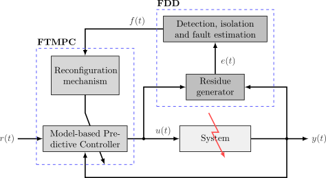

# FT-MPC Linear-case

## Abstract
This code presents the design of a Fault-Tolerant Model Predictive Control (FT-MPC) strategy for LTI systems.

	

Simulation results, based on two typical chemical industrial processes, are given to illustrate the implementation and performance of such approach.

## Requirements
- At least an i5-3337U CPU@2.7 GHz (2 Cores) with 6 GB of RAM.
- [Matlab software](https://mathworks.com/) R2016b or greater

### Packages:
- [Yalmip](https://yalmip.github.io/)
- [Gurobi](https://www.gurobi.com/)
- [SeDuMi](http://sedumi.ie.lehigh.edu/)
- LMI Lab

## Paper info
Emanuel Bernardi, Carlos A. Cappelletti and Eduardo J. Adam, "Fault-tolerant Model Predictive Control Strategy Applied to Industrial Processes," *2019 XVIII Workshop on Information Processing and Control (RPIC)*, Bahía Blanca, Argentina, 2019, pp. 31-36, doi:10.1109/RPIC.2019.8882143.

Send comments and questions to:

[Emanuel Bernardi](mailto:ebernardi@sanfrancisco.utn.edu.ar)
